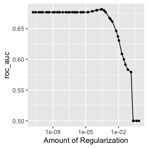
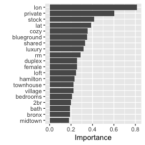

```{r setup, include=FALSE}
knitr::opts_chunk$set(
  message = FALSE,
  warning = FALSE,
  fig.align = "center",
  comment = "#>",
  collapse = TRUE,
  fig.path = "man/figures/",
  eval = FALSE
)
```


```{r}
library(nyclodging)
library(dplyr)
library(tidytext)
library(tidyr)
library(parsnip)
library(recipes)
library(workflows)
library(tune)
library(rsample)
library(dials)
library(parallel)
library(vip)
library(yardstick)
```

```{r}
set.seed(20211030)
```


```{r}
model_df <- listings %>% 
  transmute(
    list_id, 
    lon, 
    lat, 
    list_description = stringr::str_to_lower(list_description),
    price
  ) %>% 
  unnest_tokens(word, list_description) %>% 
  filter(!stringr::str_detect(word, "^[\\d[:punct:]]+$")) %>% 
  anti_join(stop_words) %>% 
  group_by(word) %>% 
  filter(n() > 100) %>% 
  group_by(list_id, lon, lat, price) %>%
  rename(price2 = price) %>% # rename to avoid confliction with the word "price"
  count(word) %>% 
  pivot_wider(names_from = word, values_from = n, values_fill = list(n = 0))

model_df
#> # A tibble: 47,483 × 263
#> # Groups:   list_id, lon, lat, price2 [47,483]
#>    list_id   lon   lat price2   apt clean  home  park quiet midtown harlem
#>      <dbl> <dbl> <dbl>  <dbl> <int> <int> <int> <int> <int>   <int>  <int>
#>  1    2539 -74.0  40.6    149     1     1     1     1     1       0      0
#>  2    2595 -74.0  40.8    225     0     0     0     0     0       1      0
#>  3    3647 -73.9  40.8    150     0     0     0     0     0       0      1
#>  4    3831 -74.0  40.7     89     0     0     0     0     0       0      0
#>  5    5022 -73.9  40.8     80     1     0     0     1     0       0      0
#>  6    5099 -74.0  40.7    200     0     0     0     0     0       1      0
#>  7    5178 -74.0  40.8     79     0     0     0     0     0       0      0
#>  8    5203 -74.0  40.8     79     1     1     0     0     0       0      0
#>  9    5238 -74.0  40.7    150     0     0     0     0     0       0      0
#> 10    5295 -74.0  40.8    135     0     0     0     0     0       0      0
#> # … with 47,473 more rows, and 252 more variables: village <int>, york <int>,
#> #   brownstone <int>, cozy <int>, entire <int>, floor <int>, central <int>,
#> #   loft <int>, spacious <int>, studio <int>, apartment <int>, br <int>,
#> #   east <int>, furnished <int>, family <int>, guest <int>, bdrm <int>,
#> #   cute <int>, lower <int>, 1br <int>, beautiful <int>, upper <int>,
#> #   west <int>, manhattan <int>, garden <int>, lovely <int>, rental <int>,
#> #   bedroom <int>, perfect <int>, chelsea <int>, backyard <int>, hip <int>, …
```

setup data split and preprocssing, use random forest model 

```{r}
# splitting 
word_split <- initial_split(model_df)
word_training <- training(word_split)
word_testing <- testing(word_split)


# L1 penalized logistic model 
model_spec <- multinom_reg(mixture = 1, penalty = tune()) %>% 
  set_mode("classification") %>% 
  set_engine("glmnet")

model_rec <- recipe(price2 ~ ., data = word_training) %>% 
  update_role(list_id, new_role = "ID") %>% 
  step_mutate(price2 = case_when(
    price2 <= 100 ~ "< 100", 
    price2 <= 200 ~ "100 to 200", 
    price2 <= 300 ~ "200 to 300", 
    price2 <= 400 ~ "300 to 400",
    price2 <= 500 ~ "400 to 500", 
    price2 <= 1000 ~ "500 to 1000", 
    price2 > 1000 ~ "> 1000"
  ) %>% factor(levels = c("< 100", "100 to 200", "200 to 300", "300 to 400", "400 to 500", "500 to 1000", "> 1000"))) %>% 
  step_zv(all_predictors()) %>% 
  step_normalize(all_predictors())

model_wf <- workflow() %>% 
  add_model(model_spec) %>% 
  add_recipe(model_rec)
```

tuning lambda 

```{r, cache = TRUE}
model_folds <- vfold_cv(word_training)

model_res <- model_wf %>% 
  tune_grid(
    model_folds, 
    grid = 50, 
    control = control_grid(save_pred = TRUE), 
    metrics = metric_set(roc_auc)
  )
```

```{r}
model_res %>% 
  show_best()
#> # A tibble: 5 × 7
#>     penalty .metric .estimator  mean     n std_err .config              
#>       <dbl> <chr>   <chr>      <dbl> <int>   <dbl> <chr>                
#> 1 0.000306  roc_auc hand_till  0.681    10 0.00292 Preprocessor1_Model33
#> 2 0.000250  roc_auc hand_till  0.681    10 0.00301 Preprocessor1_Model32
#> 3 0.000112  roc_auc hand_till  0.680    10 0.00316 Preprocessor1_Model31
#> 4 0.0000948 roc_auc hand_till  0.680    10 0.00322 Preprocessor1_Model30
#> 5 0.000484  roc_auc hand_till  0.680    10 0.00266 Preprocessor1_Model34
```


```{r model-res-autoplot}
autoplot(model_res)
```

```{r, eval = TRUE, echo = FALSE}

```


```{r, cache = TRUE}
model_best <- model_res %>% 
  select_best(metric = "roc_auc")


model_final <- finalize_workflow(model_wf, model_best) %>% 
  last_fit(split = word_split)
```

```{r}
model_final %>% collect_metrics()
#> # A tibble: 2 × 4
#>   .metric  .estimator .estimate .config             
#>   <chr>    <chr>          <dbl> <chr>               
#> 1 accuracy multiclass     0.593 Preprocessor1_Model1
#> 2 roc_auc  hand_till      0.673 Preprocessor1_Model1
```


```{r vip-plot}
model_final %>% 
  pluck(".workflow", 1) %>%   
  pull_workflow_fit() %>% 
  vip(num_features = 20)
```

```{r, echo = FALSE, eval = TRUE}

```

